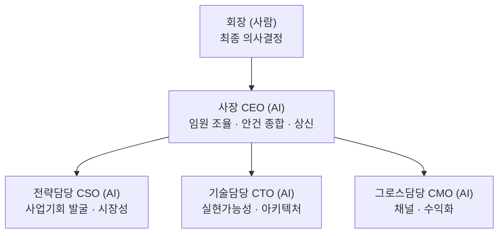

# 작업실 컴퍼니 — 가상회사 헌장

`tossneon.github.io` 모노레포 위에서 굴러가는 사이드 프로젝트들을, "1인 대표 + AI 임원진"이 실제 회사처럼 논의·의사결정·실행하는 구조로 운영하기 위한 문서 폴더. Notion이 프로젝트 목록의 정본이라면, 여기는 **경영 의사결정의 정본**이다.

## 미션

이미 만든 사이드 프로젝트 자산(circle-heroes, checknote, dividend-passbook 등)을 흩어진 실험에서 그치지 않고, AI 임원진의 상시 검토·제안을 거쳐 실제 매출/사용자로 이어지는 사업으로 키운다.

## 조직 구조

- **회장**: 사람(대표). 예산 지출, 외부 공개(스토어 등록, 브랜드 노출), 되돌리기 어려운 결정에 대한 **최종 승인권**을 갖는다.
- **사장(CEO)**: 임원진 의견을 종합해 `proposals/`에 제안서 형태로 상신한다. 승인된 계획 범위 안에서는 임원진에게 실행을 배분하고 자율 진행한다.
- **임원진(CSO/CTO/CMO)**: 각자 독립적으로 검토한다 — 서로 사전에 의견을 맞추지 않아, 만장일치가 나오면 신뢰도가 높고 의견이 갈리면 그 자체가 회장에게 보고할 중요한 신호가 된다.

## 운영 원칙

1. **독립 검토 → 사장 종합 → 회장 상신.** 임원 3인이 각자 검토한 뒤 사장이 종합해 제안서를 올린다. (매 안건 반복하는 순서)
2. **승인 라인.** 예산 지출, 스토어/외부 공개, 법적·저작권 리스크가 있는 항목은 회장 승인 필수. 그 외 실행(코드 작업, 설정 변경 등)은 승인된 계획 안에서 AI가 자율 진행.
3. **기록은 이 폴더에 남긴다.** Notion이 아니라 `company/`가 경영 의사결트 기록의 단일 소스. 회의록은 `board/`, 상신 안건은 `proposals/NNN-제목.md` 형식으로 번호를 매겨 누적한다.
4. **공개 저장소 원칙 준수.** 이 폴더도 공개 저장소 안에 있으므로 비밀키·개인정보·미공개 재무정보는 절대 적지 않는다(루트 `CLAUDE.md` 공개 저장소 주의 참고).

## 현재 임원진 (2026-08-05 창립)

| 역할 | 담당 |
|---|---|
| 사장 (CEO) | 이번 세션에서 임원 3인의 검토를 종합·상신 |
| CSO (전략) | 사업기회 스카우트 |
| CTO (기술) | 실현가능성/아키텍처 검토 |
| CMO (그로스) | 채널/수익화 검토 |

## 확장 예정 역할 (필요해지면 그때 선임)

- **COO/재무**: 예산 규모가 커지거나 세무/법률 실무가 늘어나면 선임
- **크리에이티브/아트 디렉터**: 콘텐츠 생산 라인(캐릭터 에셋 등)이 커지면 선임

## 진행 중인 안건

| 번호 | 제목 | 상태 |
|---|---|---|
| [001](proposals/001-circle-heroes-상업화-착수.md) | Circle Heroes 상업화 착수 | 회장 승인 대기 |
