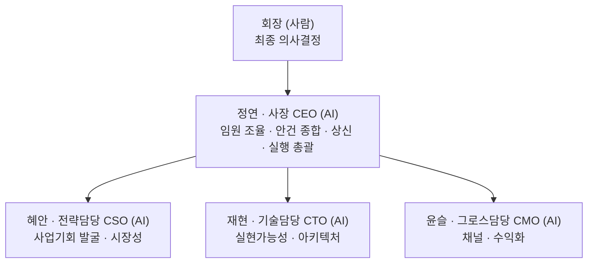

# 나다컴퍼니1(신사업) — 관계사 헌장

(2026-08-08 이전 이름: "작업실 컴퍼니")

`tossneon.github.io` 모노레포 위에서 굴러가는 사이드 프로젝트들을, "1인 대표 + AI 임원진"이 실제 회사처럼 논의·의사결정·실행하는 구조로 운영하기 위한 문서 폴더. 저장소 자체(각 프로젝트 폴더의 `meta.json`)가 프로젝트 목록의 정본이라면, 여기는 **경영 의사결정의 정본**이다.

## 미션

**이 회사는 완전히 새로운 사업을 백지상태(blank slate)에서 탐색하는 벤처스튜디오다.** 기존 사이드 프로젝트 허브(저장소 루트, `meta.json` 기반)는 원칙적으로 회장의 개인 취미/실험 영역이고 이 회사의 논의 대상이 아니다 — 업종·형태를 미리 좁히지 않고 "세상 모든 가능성"을 열어둔 채 탐색한다. 다만 개인 프로젝트와 완전히 단절된 건 아니다 — 아래 "개인 프로젝트와의 관계" 참고.

가능성이 확인된 사업은 전담 계열사로 독립시켜 본격적으로 키운다. 그와 동시에, 새로운 탐색을 계속하기 위해 별도의 탐색형 계열사를 다시 세운다 — 즉 이 구조는 "탐색 → 검증 → 독립(계열사화) → 재탐색"을 반복하는 지주회사(홀딩) 모델을 지향한다. 지금은 첫 탐색 라운드 단계이므로 계열사 분리는 아직 없다.

### 계열사 분리 판단 로직 (2026-08-08 확정)

수익이 발생한 사업을 어떻게 조직할지는 아래 순서로 판단한다:

1. **기능 구분 — 탐색 vs 운영.** 정연 사장 오피스는 여러 사업 아이디어를 동시에 리서치·테스트하는 **탐색 전담**이다. 특정 아이디어가 **1원이라도 실제 수익을 내는 순간**, 그 사업은 "탐색" 소관에서 벗어나 별도로 관리할지 판단하는 단계로 넘어간다.
2. **신설 vs 기존 편입 — 업종/테마 매칭.** 이미 있는 계열사 중 업종·테마가 맞는 곳이 있으면 그 계열사의 **새 사업 라인(제품 하나 추가)**으로 편입한다. 맞는 곳이 없으면 **새 계열사를 신설**한다. (예: 디자인 산출물 판매 계열사가 이미 있다면, 비슷한 성격의 새 상품은 그 밑에 라인으로 추가 — 완전히 다른 업종이면 새 계열사)
3. **수익 추적은 항상 사업/제품 단위로 분리.** 계열사 하나 안에 여러 사업 라인이 있어도, 각 라인의 매출·비용은 섞이지 않게 따로 기록한다. "안정적인 수익분석"이 이 구조의 존재 이유이기 때문.

이 판단은 사장(정연)이 실행하되, 새 계열사 신설처럼 조직 변화가 생기면 기존 "조직 확장" 원칙(사후 기록, 사전 승인 불필요)을 그대로 따른다.

### "공개" 단계의 정의

이 회사의 사업 라이프사이클은 **아이디어 → 탐색/테스트 → 공개(상업화)** 3단계로 본다. "공개"는 URL이 존재하는지가 아니라 **의도적으로 불특정 다수에게 노출해서 수익화를 노리는지**로 정의한다 — 이 저장소는 프로젝트를 push하는 순간 항상 라이브 URL이 생기므로, URL 존재만으로는 단계를 구분할 수 없다. 지인에게 테스트용으로 링크를 공유하는 것은 여전히 "탐색/테스트" 단계이고, 마켓플레이스 등록·유료 다운로드 오픈처럼 불특정 다수 대상 수익화가 시작되는 시점이 "공개" 단계다.

### 개인 프로젝트와의 관계 (포크형 vs 승격형)

개인 사이드 프로젝트와 이 회사는 완전히 분리돼 있지 않고, 두 가지 방식으로 넘나들 수 있다:

- **포크형**: 개인 프로젝트는 그대로 두고, 그 안의 일부(템플릿·에셋 등)만 떼어내 새로운 상업 산출물을 만드는 경우. 원본은 계속 개인 소관이고, 새 상업 산출물만 이 회사 쪽(`execution/` 등)에 기록한다.
- **승격형**: 프로젝트 전체가 개인에서 상업화로 넘어가는 경우 (예: circle-heroes — 개인으로 시작, 광고 부착 후 상업화 방향으로 전환. 개인 신분이라 앱스토어 등록이 막혀 후순위로 대기 중). 이 경우 전환 시점에 "회장 리소스 제약"(위 원칙 2 "사업자등록 불가" 등)을 체크리스트로 재확인한다 — 이 전환은 드물게 일어날 것으로 예상되어 별도의 무거운 승인 절차 없이, 그때그때 기존 제약 원칙에 비춰 판단한다.

### 예산 원칙

- 사업 아이디어의 성패를 초기 확인하는 데 쓸 수 있는 예산은 **1건당 최초 30만원(KRW) 이내**.
- **무자본(0원)으로 검증 가능한 아이디어를 최우선으로 환영**한다.
- 이 예산 안에서 뚜렷한 가능성 신호가 확인되면, 회장 승인을 거쳐 증액한다.

### 회장 리소스 제약 (2026-08-05 확정, 모든 안건에 항상 적용)

회장은 평일 09~19시 직장 근무를 병행하는 겸업 창업자다. 이 조건이 사업 후보 평가에 항상 우선 적용된다:

1. **회장의 직접 개입은 최소화한다.** 가능한 개입 형태는 (a) 하루 중 짬짬이 하는 빠른 의사결정/승인, (b) 저녁 1~2시간의 집중 작업, 이 둘뿐이다. 반복적인 평일 주간 대응이나 상시 대기가 필요한 사업은 지금 단계에서 부적합하다.
2. **사업자등록이 불가하다.** 겸업 중이라 별도 사업자등록을 낼 수 없다. 세금계산서 발행, 사업자 전용 판매채널 가입 등 사업자등록을 전제로 하는 모델은 1차적으로 배제하고, 프리랜서 플랫폼(원천징수 3.3%), 개인 창작자 수익(애드센스 등), 해외 개인 판매 플랫폼처럼 **개인 자격으로 가능한 결제/유통 구조**를 우선한다.
3. **반복적인 오프라인 대면/동행이 필요한 사업은 지금은 배제한다.** 회장의 물리적 시간이 병목이 되는 구조이기 때문. 다만 마음에 드는 아이디어라도 완전히 버리지 않고 "파킹(보류)" 상태로 기록해 둔다 — 상황이 바뀌면(시간 여유, 파트너 확보 등) 재검토한다.
4. **AI(사장·임원진)가 스스로 수행하는 일은 제한 없이 확장한다.** 리서치, 콘텐츠 제작, 코드, 자동화, 초안 작성 등 AI가 처리 가능한 범위는 이 제약과 무관하게 마음껏 키운다.
5. **정산 방식 — 현금 계좌입금 우선.** 사업 후보의 결제/정산 구조를 검토할 때, **플랫폼이 매출을 곧바로 현금으로 회장 계좌에 입금하는 방식을 최우선으로 평가**한다. 포인트·캐시 등으로 먼저 정산된 뒤 별도로 "출금 신청"을 해야 계좌로 송금되는 구조라면, **그 출금 신청을 사장(AI)이 정기적으로 대신 챙길 수 있는지**(공식 API/자동화 여부, 최소 출금 기준액, 신청 주기)를 CTO가 실현가능성 검토 항목에 포함해 반드시 확인한다. 여러 사업을 동시에 굴려도 회장이 각 플랫폼을 일일이 들여다보지 않아도 정산액이 계좌에 자연히 모이게 하는 것이 목적 — 이 확인이 안 되는(=회장이 주기적으로 직접 출금 신청을 해야 하는) 구조는 감점 요인으로 candidates.md에 명시한다.
6. **채널의 "사장(AI) 직접 운영 가능 여부" 확인 필수.** 판매·유통 채널을 확정할 때 그 채널이 리스팅 등록·수정을 **공식 API/CLI로 지원하는지 항상 확인**한다. 지원하면 최초 계정 연동(회장 몫)만 끝나면 이후 등록·수정·운영은 전부 사장이 자체 처리할 수 있고, UI 전용이면 매번 회장 손을 거쳐야 한다. 이는 신규 사업 후보 평가 단계(CTO의 "플랫폼 자동화 지원 확인", candidates.md 하단 "사장 관찰" 참고)뿐 아니라, **이미 확정되어 실행 중인 사업의 채널 운영 단계에서도 항상 재확인**한다 — 자동화가 이 회사의 핵심 조건이기 때문에, "API 지원 여부"는 매번 명시적으로 점검하고 결과를 기록으로 남긴다.

## 조직 구조

- **회장**: 사람(대표). 기본적으로 예산 지출, 외부 공개(스토어 등록, 브랜드 노출), 되돌리기 어려운 결정에 대한 **최종 승인권**을 갖는다. 특정 범위는 사장(AI)에게 위임할 수 있으며, 위임 내역은 이 문서(아래 운영 원칙)에 날짜와 함께 기록한다.
- **사장(CEO, "정연")**: 임원진 의견을 종합해 `proposals/`에 제안서 형태로 상신한다. 승인된 계획 범위 안에서는 임원진에게 실행을 배분하고 자율 진행한다. **2026-08-05부로 회장이 조직 확장 권한을 위임** — 실행 부담이 커지면 사장 판단으로 새 역할을 신설하고 여기에 기록한다(사후 보고, 사전 승인 불필요).
- **임원진(CSO "혜안"/CTO "재현"/CMO "윤슬")**: 각자 독립적으로 검토한다 — 서로 사전에 의견을 맞추지 않아, 만장일치가 나오면 신뢰도가 높고 의견이 갈리면 그 자체가 회장에게 보고할 중요한 신호가 된다.

## 운영 원칙

1. **독립 검토 → 사장 종합 → 회장 상신.** 임원 3인이 각자 검토한 뒤 사장이 종합해 제안서를 올린다. (매 안건 반복하는 순서)
2. **승인 라인.** 예산 지출, 스토어/외부 공개, 법적·저작권 리스크가 있는 항목은 회장 승인 필수. 그 외 실행(코드 작업, 설정 변경 등)은 승인된 계획 안에서 AI가 자율 진행.
   - **2026-08-05 업데이트 — 회장이 못 하는 일 vs 회장만 할 수 있는 일 구분.** 회장이 물리적으로만 할 수 있는 일(계정 가입, 본인인증, 결제수단 연결, API 토큰 발급 같은 "연동")은 회장이 하고, 그 외 콘텐츠 검수·수정·업로드·게시는 **사장이 자체적으로 판단해 처리한다.** 회장에게 매번 초안 확인을 요청하지 않는다 — 결과가 이상하면 회장이 나중에 보고 피드백을 준다.
   - **API 토큰 등 인증정보는 절대 이 저장소(공개)에 커밋하지 않는다.** 회장이 발급 후 세션 환경변수 등 저장소 밖의 경로로 전달하면, 사장이 그걸로 업로드까지 자동화한다.
   - **2026-08-06 업데이트 — "스토어/외부 공개 회장 승인 필수" 원칙에 예외 신설.** 채널이 이미 연동 완료(계정·API 토큰 확보)돼 있고 상품이 [원칙 6](#운영-원칙) 자동화 검증을 통과한 경우, **신규 상품의 공개(발행)도 사장이 매번 승인 없이 바로 진행한다.** 대신 발행 전 반드시 다음 점검을 거친다: (1) API로 상품 필드(가격·설명·이미지·태그 등) 재확인, (2) 발행 직후 실제 공개 페이지를 캡처해 정상 렌더링 확인 — 문제 발견 시 즉시 비공개로 롤백. 이 점검 없이 발행하지 않는다. (예시: `execution/products/04-gumroad-업로드-준비.md`)
   - **2026-08-06 업데이트 — 상시 소액 할인코드 운영 방침.** 회장 지시로, 판매 채널이 할인코드 기능을 지원하면 상품마다 상시 소액 할인코드(구매수·기한 제한 없음)를 기본으로 걸어 매력도를 높인다. 다만 이미 런칭 할인가가 적용된 상품에 추가로 코드 할인을 얹으면 저가 인식 리스크가 커질 수 있어, 사장이 매 상품마다 할인 폭을 판단해 적용하고 이례적인 경우 기록에 근거를 남긴다.
3. **조직 확장.** 특정 사업(예: A1)의 실행 부담이 커져 기존 임원 3인 체제로 못 감당하면, 사장이 새 역할을 신설해 배정하고 이 문서 "현재 임원진"에 추가한다. 사전 승인 불필요, 사후 기록만.
   - **2026-08-08 확정 — "충원 대기"는 개념 자체가 없다.** AI 직원이라 실제 인건비가 들지 않으므로, 사장 판단으로 필요하면 승인 없이 바로 충원(=새 역할 신설)하고 사후 공유만 한다. 이 원칙은 나다컴퍼니1뿐 아니라 나다그룹 산하 모든 관계사(나다컴퍼니2 등)에 동일하게 적용된다. 나다그룹 HQ 대시보드의 "충원 대기" 표시는 이 확정에 따라 제거함.
4. **기록은 이 폴더에 남긴다.** Notion이 아니라 `company1/`가 경영 의사결정 기록의 단일 소스. 회의록은 `board/`, 상신 안건은 `proposals/NNN-제목.md`, 실제 실행 작업은 `execution/`에 남긴다.
5. **공개 저장소 원칙 준수.** 이 폴더도 공개 저장소 안에 있으므로 비밀키·개인정보·미공개 재무정보는 절대 적지 않는다(루트 `CLAUDE.md` 공개 저장소 주의 참고).
6. **호칭 정책 (2026-08-08 확정).** 사장(정연) 외에는 신규 역할에 개인 이름을 부여하지 않는다 — 직책/역할명(예: "CTO", "○○계열사 운영담당")으로만 표기한다. 기존에 이미 이름이 있는 임원(혜안·재현·윤슬)은 그대로 유지. 회장이 필요하다고 판단하면 그때 다시 이름을 부여한다.

## 현재 임원진 (2026-08-05 창립, 2026-08-05 조직 확장 권한 위임)

| 역할 | 이름 | 담당 |
|---|---|---|
| 사장 (CEO) | **정연** | 임원 검토 종합·상신, A1 실행 총괄 |
| CSO (전략) | 혜안 | 사업기회 스카우트 |
| CTO (기술) | 재현 | 실현가능성/아키텍처 검토 |
| CMO (그로스) | 윤슬 | 채널/수익화 검토 |

(이름은 사장이 이번에 제안한 것 — 회장 마음에 안 드시면 언제든 교체 가능)

## 확장 예정 역할 (필요해지면 사장이 그때 신설)

- **콘텐츠/제작 담당**: A1·A3처럼 실제 상품(프롬프트팩, 디자인 등) 생산량이 늘어 병렬 작업이 필요해지면 신설
- **COO/재무**: 예산 규모가 커지거나 세무/법률 실무가 늘어나면 선임
- **크리에이티브/아트 디렉터**: 콘텐츠 생산 라인(캐릭터 에셋 등)이 더 커지면 선임

## 가상 사무실 — 나다그룹 HQ

**(2026-08-08 개편)** 회장이 틈틈이 들여다볼 수 있는 시각화 화면은 **나다그룹 HQ** — `../nada-group/` (배포 후 `https://tossneon.github.io/nada-group/play/`). 좌측 nav에서 관계사를 전환하는 **지주사 콘솔** 형태고, 오퍼레이션 콘솔 비주얼(다크 테마, 팀장 이하 사원증 착용 등)은 회장이 3라운드 디자인 검토 끝에 확정한 것 — 구조를 바꿀 땐 이 확정 사항을 존중할 것.

- **나다그룹**: HQ 진입점(`nada-group/`). 좌측 nav에 관계사 목록이 뜬다.
- **나다컴퍼니1(신사업)**: 이 문서(`company1/`)가 다루는 회사. HQ 콘솔 안에서 **직접 운영 화면(mode: "op")**으로 보여준다 — 대표실(정연)·전략팀(CSO)·기술팀(CTO)·그로스팀(CMO)·회의실 방, `company1/candidates.md`의 A1~A5 사업 라인, 승인 대기·지시 접수함까지. 데이터 소스는 `nada-group/src/data/holdco.config.ts` — `registry.js`와 같은 **스냅샷 패턴**(실시간 연동 아님, 이 문서·`candidates.md`에 의미 있는 변화가 있을 때마다 갱신). **주의**: 이 콘솔은 임원진 실명(혜안·재현·윤슬)을 의도적으로 숨기고 역할명만 노출한다 — 이 문서의 실명 표기를 고친 게 아니라 화면 표시 정책만 그런 것.
- **`pixel-ai-office`**: 계열사가 아니라, 이 HQ 콘솔을 만들기 전에 먼저 시도했던 오피스 시뮬레이션 프로토타입. HQ nav엔 "pixel-ai-office (프로토타입)"으로 참고용 링크만 걸려 있고, 사업체로 취급하지 않는다.

계열사가 늘어나면 `nada-group/src/data/holdco.config.ts`의 `COMPANIES`(및 `ROOMS`/`STAFF`/`BUSINESS_LINES`)에 항목을 추가하는 식으로 확장한다. 다음 단계(Phase 2 — 승인/지시 상태 영속화, Cloudflare Worker 연동)는 `nada-group/HANDOFF.md` 참고 — Cloudflare API 토큰 발급 대기 중.

## 사업 후보 현황

탐색 라운드를 거듭할수록 이력이 쌓이므로, **최신 확정 상태는 항상 [`candidates.md`](candidates.md) 하나만 보면 됩니다.** 각 라운드의 논의 과정(왜 그렇게 판정했는지)은 아래 안건 이력에 남습니다.

## 안건 이력

| 번호 | 제목 | 상태 |
|---|---|---|
| [001](proposals/001-circle-heroes-상업화-착수.md) | Circle Heroes 상업화 착수 | ⚪ 범위 재조정(개인 프로젝트로 이관) |
| [002](proposals/002-신사업-백지탐색-1라운드.md) | 신사업 백지탐색 1라운드 | ⚪ 003으로 통합·확장 |
| [003](proposals/003-신사업-재탐색-2라운드.md) | 신사업 재탐색 2라운드 (겸업 제약 반영) | ⚪ candidates.md로 통합 |
| [board: 완전자동화 재검증](board/2026-08-05-완전자동화-재검증.md) | Tier B "개입=0" 재검증 + 3라운드 탐색 | ✅ candidates.md 반영 완료 |
| [board: 6시간 자율 생산](board/2026-08-06-6시간-자율생산.md) | A1 런칭 + A2/A3/A5 준비 + A1 2호 상품 | 🟡 진행 중 (회장 최종 보고 대기) |
| 나다컴퍼니2 신설 | 실행 전담 계열사(Gumroad 콘텐츠 업로드 롤) — "계열사 분리 판단 로직" 중 신설 케이스 첫 적용 | ✅ 대표 "하윤" 선임(2026-08-09), 나다컴퍼니1(정연)과 별도 독립 신사업 탐색 트랙 병행. 문서는 [`company2/`](../company2/README.md). Round 1 스캔 완료(니치 API 프로덕트/RapidAPI Hub 1순위) — [`company2/candidates.md`](../company2/candidates.md) |
| 나다컴퍼니3 신설 | 자산운용 실험 계열사(코인/주식 중 택일, 초기자본 30만원, 수익 최대화) | ✅ 대표 "은성" 선임(2026-08-09). Round 1 조사 완료 — **코인을 1차 자산군으로 확정**, 저빈도 스윙/알고리즘 전략 + 페이퍼 트레이딩 진행 중. **실거래는 회장이 계좌 개설(본인인증 필수)·매매 권한 범위를 확정하기 전까지 보류.** 문서는 [`company3/`](../company3/README.md), 비교표는 [`company3/candidates.md`](../company3/candidates.md) |
| 나다컴퍼니4 신설 | 진단 상품화 계열사 — 회장의 버크만 시그니처 디브리퍼 자격을 근간으로 시작, 이후 무자격 진단군으로 라인업 확장 | ✅ 대표 "채원" 선임(2026-08-09). 기존 `birkman-automation/`(구매대행+AI디브리핑 파이프라인, 버크만 전용 확인 게이트 — [`.claude/rules/birkman.md`](../.claude/rules/birkman.md))이 이 계열사의 기술 기반. **최종 목표는 완전 자동화(회장 개입 0)지만, 브랜딩·스토어 개설·플랫폼 확장·상품 컨셉·상세페이지 등 초기 세팅은 회장과 긴밀히 협의하며 진행** — 다른 계열사보다 초기 자율성 낮게 시작 |

### 나다컴퍼니3 — 실거래 확인 게이트 (2026-08-09, birkman.md와 동일한 이유로 보수적 시작)

다른 계열사(콘텐츠·상품 판매)와 다르게, 실제 시장 손실이 되돌릴 수 없다는 점에서 CLAUDE.md 자율성
원칙 1번("되돌릴 수 없는 결정")에 정면으로 해당한다. 그래서:

- **조사·전략 수립(자산군 비교, 백테스트, 페이퍼 트레이딩)은 은성이 자율 진행**한다.
- **실제 매매(진짜 돈이 오가는 매수/매도)는 다음이 갖춰지기 전까지 하지 않는다**: (1) 회장이 실거래
  계좌를 직접 개설·본인인증(거래소/증권사 KYC는 물리적으로 회장만 가능), (2) 회장이 매매 실행
  권한 범위(완전자율 vs 건별승인 vs 손실한도 내 자율 등)를 확정.
- 계좌 개설 후 첫 실거래 전에 반드시 회장에게 전략 요약 + 권한 범위 재확인을 받는다.
- 이후 안정적으로 운영된다고 판단되면(birkman.md 결제 게이트와 동일한 패턴) 완화를 검토한다.
